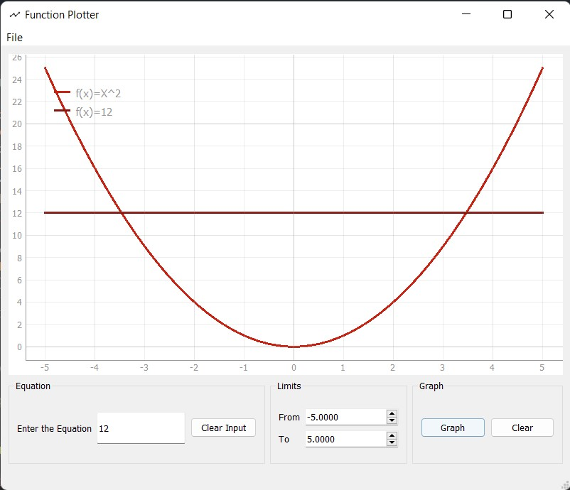
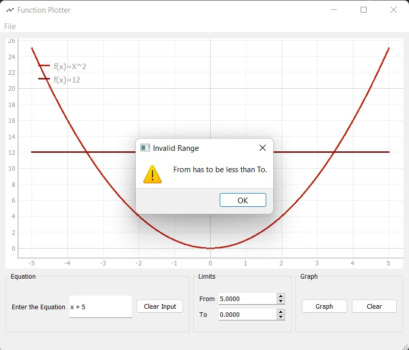

# Function Plotter

A Simple Mathematical Tool for Plotting Simple Equations Using Python and PyQt5 GUI Components

## Setting Up the Environment

Inside the Project Folder Run

```sh
(both)        $ python -m venv venv
(powershell)  $ .\venv\Scripts\Activate.ps1
(shell|zsh)   $ source venv/bin/activate
(both)        $ python -m pip install --upgrade pip
(both)        $ pip install -r requirements.txt
```


## Running the Test Cases

Inside the ___src___ folder type

```sh
python -m unittest
```


## Usage

The Program Supports the Following Operations

addition(+), subtraction(-), multiplication(*), division(/), power(^)

Examples for Valid Inputs:

- 3x^2-5x+3
- 4 X + 5
- (x+2)^2 / (3*x-10)^3

Examples for Invalid Inputs:

- 3xy-10 (only the letter x is supported)
- sin(x)^2 (only +, -, *, /, and ^ are supported)
- xx (invalid equation)

## Showcase Screenshots

The Main UI Contains

- New Child Window
- Exit Current Window
- Enter and Clear the Equation (Enter the equation is triggerd by pressing Enter)
- Enter Limits (from, to, and step)
- Graph and Clear Buttons (Disabled Until write Equation)


After Drawing a Simple Graph it Shows with a Random Color and Legend With the Function Definition


Can Insert Multiple Graphs at the Same Screen



Invalid Equations Popup Window


Invalid Range Because of From being greater than to


